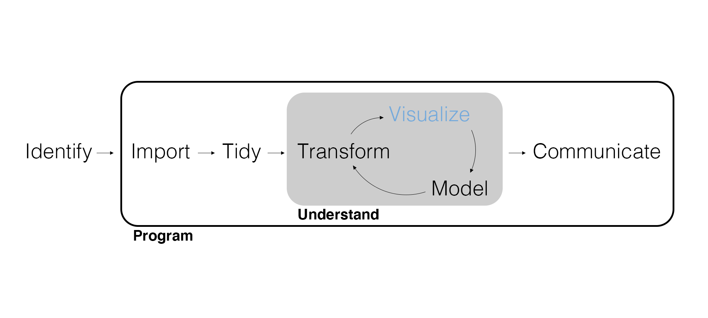
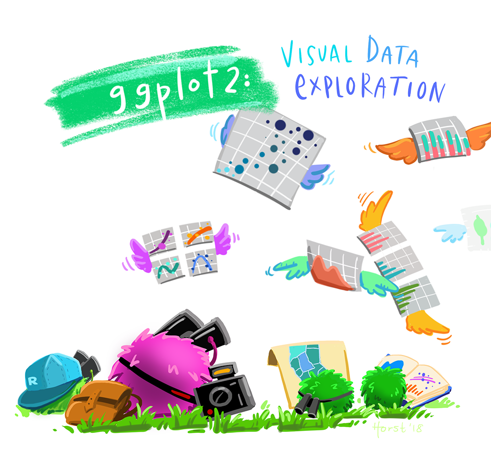

## Spiritual Thought

DC 6:36: "Look unto me in every thought; doubt not, fear not."

"As an apostle of the Lord Jesus Christ, I invoke these blessings upon you, that as you look to the Savior and trust in Him, you will be blessed with hope to overcome perplexity, with spiritual settledness to cut through commotion, with ears to hear and a heart to always remember the word of the Lord, and with the discernment to see things as they really are."

David A. Bednar - [BYU Speeches, April 16th, 2021](https://speeches.byu.edu/talks/david-a-bednar/look-unto-me-in-every-thought-doubt-not-fear-not/)

## Grading Exercises

Remember that you grade your own submitted exercises using the rubric specified in each posted exercise solution, adding comments (using the comment feature for Word documents) where your solution differs from the posted solution.


## Marketing Analytics Process

<center>
{width=900px}
</center>

---

{width=900px}
## Motivating Example

Imagine your manager at Patagonia is happy with your ability to filter and organize data, but she wants you to find another way to share your findings with stakeholders in a presentation you'll be giving tomorrow. What are some concise and effective ways that you could communicate data about Patagonia's customer base?


## Discrete Data

Remember that summarizing data is initially all about discovery, the heart of **exploratory data analysis**.

- Computing **statistics** (i.e., numerical summaries).
- **Visualizing** data (i.e., graphical summaries).

How we summarize depends on whether the data is **discrete** or **continuous**.

- Discrete means "individually separate and distinct."
- Discrete data are also called *qualitative* or *categorical*.

---

```{r}
library(tidyverse)
```

---

Can you identify any *discrete* variables? What are their data types in R?

```{r}
customer_data <- read_csv("customer_data.csv", show_col_types = FALSE)
glimpse(customer_data)
```

## A Word About Data Types

Data **types** in R — as in all programming languages — are more than simple labels. They serve as essential instructions that tell the computer how to interpret and manipulate the values we provide. Some common ones include:

| **Data Type**       | **Abbreviation** | **Description**                               |
|---------------------|------------------|-----------------------------------------------|
| `logical`           | `lgl`            | Boolean values: `TRUE`, `FALSE`, or `NA`      |
| `integer`           | `int`            | Whole numbers (e.g. `1`, `42`)             |
| `double` (numeric)  | `dbl`            | Decimal numbers (e.g. `3.14`, `2.0`)         |
| `character`         | `chr`            | Text strings (e.g. `"hello"`, `"R"`)         |
| `factor`            | `fct`            | Categorical data with fixed levels (e.g. `"Low"`, `"High"`)            |


## Summarize Discrete Data

An important statistic for a discrete variable is a **count**.

```{r}
customer_data |> 
  count(region)
```

---

How would I get a count by both `region` and `college_degree` (i.e., a **cross-tab**)?

---

```{r}
customer_data |> 
  count(region, college_degree)
```

## Your Turn!

Write code that first filters the data to only unmarried customers, then counts the customers in each region (you will need to use code we learned in the last lecture to do this!)

## Solution

```{r}

customer_data |>
  filter(married == 'No') |>
  count(region)

```


## Visualize Data

{ggplot2} provides a consistent **grammar of graphics** built with **layers**.

1. Data – Data to visualize.
2. Aesthetics – Or "aes," mapping graphical elements to data.
3. Geometry – Or "geom," the kind of graph representing the data.
4. Facets, Labels, Scales, etc.

---

<center>
{width=600px}
</center>

## Visualize Discrete Data

Plot our first summary (note how `+` is different from `|>`).

```{r eval=FALSE}
customer_data |> 
  count(region) |> 
  ggplot(aes(x = region, y = n)) +
  geom_col()
```

---

```{r echo=FALSE}
customer_data |> 
  count(region) |> 
  ggplot(aes(x = region, y = n)) +
  geom_col()
```

---

Visualize our second summary by adding the aesthetic `fill = college_degree`.

The geom `position` argument of the `geom_col()` function is set to `stack` by default. Try `fill` instead.

---

```{r}
customer_data |> 
  count(region, college_degree) |> 
  ggplot(aes(x = region, y = n, fill = college_degree)) +
  geom_col()
```

---

```{r}
customer_data |> 
  count(region, college_degree) |> 
  ggplot(aes(x = region, y = n, fill = college_degree)) +
  geom_col(position = "fill")
```

## Facets

Facets allow us to visualize by another discrete variable. For example, is this relationship different depending on `gender`?

```{r eval=FALSE}
customer_data |> 
  count(region, college_degree, gender) |> 
  ggplot(aes(x = region, y = n, fill = college_degree)) +
  geom_col(position = "fill") +
  facet_wrap(~ gender)
```

---

```{r echo=FALSE}
customer_data |> 
  count(region, college_degree, gender) |> 
  ggplot(aes(x = region, y = n, fill = college_degree)) +
  geom_col(position = "fill") +
  facet_wrap(~ gender)
```

## Labels and Scales

It's no longer a count on the y-axis. Let's change the labels.

```{r eval=FALSE}
customer_data |> 
  count(region, college_degree, gender) |> 
  ggplot(aes(x = region, y = n, fill = college_degree)) +
  geom_col(position = "fill") +
  facet_wrap(~ gender) +
  labs(
    title = "Proportion of Customers with College Degrees by Region and Gender",
    subtitle = "Based on 10,531 Customers in the CRM Database",
    x = "Region",
    y = "Proportion"
  )
```

---

```{r echo=FALSE}
customer_data |> 
  count(region, college_degree, gender) |> 
  ggplot(aes(x = region, y = n, fill = college_degree)) +
  geom_col(position = "fill") +
  facet_wrap(~ gender) +
  labs(
    title = "Proportion of Customers with College Degrees by Region and Gender",
    subtitle = "Based on 10,531 Customers in the CRM Database",
    x = "Region",
    y = "Proportion"
  )
```

---

What about the legend? And these *colors*?

```{r eval=FALSE}
customer_data |> 
  count(region, college_degree, gender) |> 
  ggplot(aes(x = region, y = n, fill = college_degree)) +
  geom_col(position = "fill") +
  facet_wrap(~ gender) +
  labs(
    title = "Proportion of Customers with College Degrees by Region and Gender",
    subtitle = "Based on 10,531 Customers in the CRM Database",
    x = "Region",
    y = "Proportion"
  ) +
  scale_fill_manual(
    name = "College Degree",
    values = c("royalblue", "darkblue")
  )
```

---

```{r echo=FALSE}
customer_data |> 
  count(region, college_degree, gender) |> 
  ggplot(aes(x = region, y = n, fill = college_degree)) +
  geom_col(position = "fill") +
  facet_wrap(~ gender) +
  labs(
    title = "Proportion of Customers with College Degrees by Region and Gender",
    subtitle = "Based on 10,531 Customers in the CRM Database",
    x = "Region",
    y = "Proportion"
  ) +
  scale_fill_manual(
    name = "College Degree",
    values = c("royalblue", "darkblue")
  )
```

## Text Data

Text data is also discrete but it is **unstructured**.

- Authors can express themselves freely.
- The same idea can be expressed in many ways.

What sort of structure might we impose on text data so we can visualize it?

## Tokenize Text Data

We can use `unnest_tokens()` to **tokenize** the text (i.e., split it into individual words or tokens).

```{r}
review_data <- customer_data |>
  select(customer_id, review_text) |> 
  tidytext::unnest_tokens(word, review_text)

review_data
```

## Summarize Text Data

With the text data tokenized, we can compute counts just like other discrete data.

```{r}
review_data |> 
  count(word) |> 
  arrange(desc(n))
```

## Drop Missing Data

**Missing values** are (and should be) encoded as `NA`.

```{r}
review_data <- review_data |> 
  drop_na(word)

review_data
```

## Remove Stop Words

Commonly used words aren’t very informative and are referred to as **stop words**.

```{r}
tidytext::stop_words
```

---

This is just a data frame, and we know how to join data frames!

An **anti join** returns rows that *don't* have matching IDs, keeping only the columns from the "left" data frame. (Think of it as the opposite of an inner join.)

```{r}
review_data <- review_data |>
  anti_join(tidytext::stop_words, join_by(word))

review_data |> 
  count(word) |> 
  arrange(desc(n))
```

---

<center>
{width=500px}
</center>

## Visualize Word Counts

```{r eval=FALSE}
review_data |> 
  count(word) |> 
  arrange(desc(n)) |> 
  ggplot(aes(x = word, y = n)) +
  geom_col()
```

---

What can we do to make this plot readable?

```{r echo=FALSE}
review_data |>
  count(word) |>
  arrange(desc(n)) |>
  ggplot(aes(x = word, y = n)) +
  geom_col()
```

## Factors

Unlike a character variable, a **factor** can include information about order.

- A factor's `levels` are numeric values that encode order.
- A factor's `labels` are the character string associated with each level.

```{r eval=FALSE}
review_data |> 
  count(word) |> 
  arrange(desc(n)) |> 
  slice(1:10) |> 
  mutate(word = fct_reorder(word, n)) |>
  ggplot(aes(x = n, y = word)) +
  geom_col()
```

---

```{r echo=FALSE}
review_data |> 
  count(word) |> 
  arrange(desc(n)) |> 
  slice(1:10) |> 
  mutate(word = fct_reorder(word, n)) |>
  ggplot(aes(x = n, y = word)) +
  geom_col()
```

## Wrapping Up

*Summary*

- Computed counts, including tokenizing and counting text.
- Practiced the basics of plotting with {ggplot2}.

*Next Time*

- Summarizing continuous data with {dplyr}.
- Visualizing continuous data with {ggplot2}.

*Supplementary Material*

- *R for Data Science (2e)* Chapters 2 and 18

*Artwork by @allison_horst*

## Exercise 3

In RStudio on Posit Cloud, create a new R script and do the following.

1. Load the tidyverse.
2. Import and explore `customer_data` using the functions we've covered.
3. Provide at least one interesting numeric summary and one interesting visualization using discrete variables only.
4. Practice good coding conventions: Comment often, write in consecutive lines of code using the `|>`, and use the demonstrated style (e.g., variable names, spacing within functions).
5. Export the R script and upload to Canvas.

